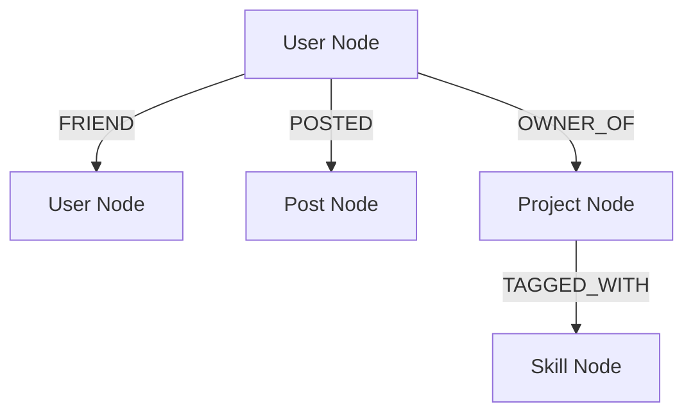

# 🚀 StudyBuddy — Project Overview & Changelog

StudyBuddy adalah platform media sosial interaktif dan jejaring kolaborasi akademis antar mahasiswa yang dirancang khusus untuk memetakan hubungan pertemanan, proyek, dan postingan secara efisien. Proyek ini dibangun sebagai tugas akhir mata kuliah **Sistem Basis Data (SBD) Semester 4**.

Berbeda dengan database relasional tradisional (RDBMS) seperti PostgreSQL atau MySQL, StudyBuddy memanfaatkan **Graph Database (Neo4j)** untuk memetakan hubungan antarentitas secara alami menggunakan node dan relationship yang sangat cepat dan scalable.

---

## 📊 1. Arsitektur & Model Graph Database (Neo4j)

Database kami memetakan entitas sebagai **Nodes** (simpul) dan interaksi mereka sebagai **Relationships** (sisi berarah).

### Nodes (Entitas Utama):
1. **`User`**: Menyimpan data profil mahasiswa (Nama, Email, Bio, Jurusan, Fakultas, Angkatan, dan Foto Profil).
2. **`Post`**: Menyimpan artikel akademis, keluhan kuliah, atau tips belajar yang dibagikan pengguna.
3. **`Project`**: Menyimpan repositori proyek, deskripsi, tautan github, dan kebutuhan kolaborator.

### Relationships (Relasi & Graf):
* `(:User)-[:FRIEND {status: "accepted"}]->(:User)` (Relasi pertemanan timbal balik).
* `(:User)-[:POSTED]->(:Post)` (Kepemilikan postingan).
* `(:User)-[:OWNER_OF]->(:Project)` (Kepemilikan proyek).

---

## 🛠️ 2. Stack Teknologi Modern

Proyek ini dibangun menggunakan arsitektur **Monorepo** yang terorkestrasi secara paralel menggunakan **Turborepo**:
* **Frontend**: Next.js 16 (App Router) + React + Tailwind CSS + Lucide Icons.
* **Backend**: Node.js + Express.js + Cookie Parser + CORS.
* **Database**: Neo4j AuraDB (Cloud Instance via Bolt Protocol).
* **Media Storage**: Cloudinary API (Unggah foto profil & gambar proyek secara real-time).

---

## 📝 3. Changelog Lengkap (Riwayat Perubahan)

Berikut adalah daftar peningkatan fitur, perbaikan bug, dan integrasi modul dari versi baseline hingga versi final:

### 🚀 v1.3 - Stabilitas Port & Resolusi Konfigurasi Git (Terbaru)
* **Dynamic CORS Localhost Port Resolver**: Mengimplementasikan pendeteksi port dinamis pada Express backend. Jika Next.js frontend berjalan di port selain `3000` (seperti `5000` atau `3002` akibat tabrakan port di komputer lokal), CORS akan otomatis menyesuaikan asal (*origin*) sehingga koneksi API tetap lancar tanpa hambatan keamanan browser.
* **Git Merge Conflict Clearance**: Menyelesaikan konflik penggabungan berskala besar (`add/add` conflict) antara repository lokal dan remote GitHub secara aman menggunakan strategi `--ours`, mempertahankan 100% fungsionalitas UI AI Studio dan Social OAuth yang telah dibangun.

### 🔑 v1.2 - Integrasi Google & GitHub Social OAuth
* **Social Handshake Controller**: Membuat *token-exchange flow* nyata pada server Express untuk melakukan verifikasi profile langsung ke API OAuth Google & GitHub.
* **Smart Developer Onboarding Modal**: Menambahkan modal bypass yang elegan di frontend login. Jika kunci API OAuth belum dikonfigurasi di file `.env`, developer dapat menggunakan fitur **Demo Bypass** 1-klik untuk menyimulasikan autentikasi dan langsung membuat node pengguna baru di Neo4j.

### 🎨 v1.1 - Canva-Inspired AI Studio (`/ai` Portal)
* **Apple-Style AI Workspace**: Mendesain workspace editor premium dengan navigasi bilah samping (*sidebar*) vertikal berwarna abu-abu mewah dan teks gradasi linear violet-ke-biru bertuliskan: *"What will we build today?"*.
* **High-Fidelity Action Engines**:
  1. **Schema Builder** 📊: Menghasilkan kode kueri grafis Neo4j (Cypher) secara otomatis berdasarkan topik belajar.
  2. **Brainstorm Ideas** 💡: Memberikan saran topik riset inovatif secara instan.
  3. **Draft Code** 💻: Membuat draf potongan kode program.
  4. **Sprint Roadmaps** ✅: Menyusun jadwal belajar terstruktur.
* **Typewriter Animation**: Menambahkan efek teks mengetik yang dinamis saat AI menyajikan jawaban markdown.

### 🐛 v1.0 - Perbaikan Render Neo4j & Optimalisasi Logo
* **Neo4j Integer React Child Resolver**: Memperbaiki runtime crash populer Next.js *"Objects are not valid as a React child"*. Seluruh angka pengidentifikasi dan counter database (tipe data Integer Neo4j yang memiliki struktur `{low, high}`) kini dibungkus secara aman menggunakan fungsi parser `unwrapNeo4jInt`.
* **Premium Logo Integration**: Menghilangkan kotak pembatas putih pada logo `logo.png` menggunakan efek *multiply blend* CSS, dan memperbesar skala logo di Navbar dari `h-8` menjadi **`h-14`** agar terlihat jauh lebih menonjol dan profesional bagi pengguna.
