# 🎓 Study Buddy

<div align="left">

[](https://turbo.build/)
[](https://nextjs.org/)
[](https://expressjs.com/)
[](https://neo4j.com/)
[](https://nodejs.org/)
[](https://opensource.org/licenses/MIT)

</div>

An academic graph collaboration platform designed to help university students discover study partners, project collaborators, and research cohorts based on academic demographics, shared courses, skills, and learning goals. The project is structured as a high-performance monorepo using **Turborepo** and is powered by the **Neo4j Graph Database** engine.

---

## 🛠️ Tech Stack & System Architecture

| Layer | Technology | Purpose & Specifications |
| :--- | :--- | :--- |
| **Monorepo** | **Turborepo** (`turbo`) | Parallel tasks, cached pipelines, unified dependency management. |
| **Frontend** | **Next.js 16** + **TypeScript** | React 19 Client UI with elegant, Apple-inspired Human Interface guidelines (Glassmorphism design language). |
| **Backend** | **Express.js** + **Node.js** | RESTful API controller layer connected directly to Neo4j using the native `neo4j-driver`. |
| **Database** | **Neo4j AuraDB** | Cloud-native Property Graph Database for lightning-fast relation traversals and Cypher queries. |
| **Real-time** | **Socket.io** | Real-time web socket server and client synchronization for messaging and in-app notifications. |
| **GenAI Engine** | **Gemini AI Studio SDK** | Gemini 1.5 Flash assistant integration for generating graph schemas, milestones, brainstorming, and code. |
| **Styling** | **Tailwind CSS v4** | Highly custom glassmorphism utility classes (`backdrop-blur-xl`, `bg-white/60`, custom typography). |

---

## 📊 Graph Database Schema (Neo4j)

The application utilizes a rich social graph schema to match students. Relationship links and traversals form the foundation of our recommendations engine.

```mermaid
graph TD
    User([User])
    Fakultas([Fakultas])
    Jurusan([Jurusan])
    Angkatan([Angkatan])
    Skill([Skill])
    Interest([Interest])
    MataKuliah([Mata Kuliah])
    Project([Project])
    Message([Message])
    Flashcard([Flashcard])
    CourseGrade([Course Grade])
    Notification([Notification])
    Opportunity([Opportunity])
    Post([Post])
    Certificate([Certificate])

    User -->|BELONGS_TO_FAKULTAS| Fakultas
    User -->|MAJORS_IN| Jurusan
    User -->|CLASS_OF| Angkatan
    User -->|HAS_SKILL| Skill
    User -->|INTERESTED_IN| Interest
    User -->|ENROLLED_IN| MataKuliah
    
    User -->|IS_FRIENDS_WITH| User
    User -->|HAS_PENDING_REQUEST| User
    
    User -->|CREATED_PROJECT| Project
    User -->|JOINED_PROJECT| Project
    User -->|HAS_PENDING_JOIN_REQUEST| Project
    Project -->|USES_SKILL| Skill
    
    User -->|SENT_MESSAGE| Message
    Message -->|DELIVERED_TO| User
    
    User -->|CREATED_FLASHCARD| Flashcard
    User -->|TRACKS_GRADE| CourseGrade
    User -->|HAS_NOTIFICATION| Notification
    
    User -->|POSTED_OPPORTUNITY| Opportunity
    User -->|APPLIED_FOR| Opportunity
    
    User -->|POSTED| Post
    User -->|LIKED| Post
    User -->|COMMENTED| Post
    
    User -->|EARNED_CERTIFICATE| Certificate
```



### Core Cypher Node Labels
*   `User`: Student academic profile node (fields: `id`, `email`, `password` (hashed), `name`, `bio`, `profilePicture`, `linkedin`, `github`, `instagram`).
*   `Fakultas` / `Jurusan`: Faculty and major tags (field: `name`).
*   `Angkatan`: Academic cohort year (field: `year`).
*   `Skill`: Technical/academic skill nodes (field: `name`).
*   `Interest`: Shared learning or domain interests (field: `name`).
*   `MataKuliah`: Enrolled university courses (fields: `name`, `code`).
*   `Project`: Collaborative student projects (fields: `id`, `title`, `description`, `imageUrl`, `demoUrl`, `status`, `createdAt`).
*   `Message`: Private chat message nodes (fields: `id`, `content`, `createdAt`, `senderId`, `receiverId`).
*   `Flashcard`: Self-study review flashcard nodes (fields: `id`, `question`, `answer`, `difficulty`, `createdAt`).
*   `CourseGrade`: Grade tracking record nodes (fields: `id`, `courseName`, `credits`, `grade`, `createdAt`).
*   `Notification`: User action notifications (fields: `id`, `text`, `type`, `read`, `createdAt`).
*   `Opportunity`: Lab assistant and project job openings (fields: `id`, `company`, `role`, `info`, `link`, `logoBg`, `createdAt`).
*   `Post`: Social forum posts (fields: `id`, `content`, `imageUrl`, `createdAt`).
*   `Certificate`: Academy course completion award nodes (fields: `id`, `courseTitle`, `earnedAt`, `certificateId`, `titleAwarded`).

### Relationship & Social Schema
*   `HAS_PENDING_REQUEST`: Directed connection representing a pending friendship invitation.
*   `IS_FRIENDS_WITH`: Bidirectional mutual friendship connection.
*   `CREATED_PROJECT` / `JOINED_PROJECT`: Directed project authorship and membership status.
*   `HAS_PENDING_JOIN_REQUEST`: Directed join project requests containing candidate information (`role`, `message`, `createdAt`).
*   `USES_SKILL`: Directed project dependencies indicating skill prerequisites.
*   `SENT_MESSAGE` / `DELIVERED_TO`: Chat routing edges between sender/receiver users and message nodes.
*   `CREATED_FLASHCARD`: Link connecting users to their private flashcards.
*   `TRACKS_GRADE`: Grade monitoring links linking users to academic scores.
*   `HAS_NOTIFICATION`: Inboxes linking users to dynamic system notifications.
*   `POSTED_OPPORTUNITY`: Career posts created by lab administrators/users.
*   `APPLIED_FOR`: Applicant records linking students to career opportunities (`appliedAt`, `studentId`, `coverLetter`).
*   `POSTED` / `LIKED` / `COMMENTED`: Social feed interactions between user profiles and posts.
*   `EARNED_CERTIFICATE`: Credential links connecting academy graduates to their earned certificates.

---

## 🧠 Core Search & Recommendation Algorithms

The backend contains optimized **Cypher** queries executing four key matchmaking methodologies:

1.  **Search by Academic Filters (Case-Insensitive & Dynamic)**
    *   *Mechanism*: Dynamically matches student profiles using partial, case-insensitive string filtering (`toLower` and `CONTAINS`) against linked `Fakultas`, `Jurusan`, or `Angkatan` relationships. If a filter is empty or set to "Semua", it is gracefully ignored.
2.  **Recommendations by Shared Interests (Case-Insensitive)**
    *   *Mechanism*: Computes overlapping academic interests by evaluating matching string names (case-insensitive) between nodes and sorting by interest density.
    *   *Cypher logic*: `MATCH (me:User {id: $userId})-[:INTERESTED_IN]->(myInt:Interest), (other:User)-[:INTERESTED_IN]->(otherInt:Interest) WHERE me.id <> other.id AND toLower(myInt.name) = toLower(otherInt.name) RETURN other, count(otherInt) AS mutualInterests ORDER BY mutualInterests DESC`
3.  **Mutual Skills Matchmaking (Case-Insensitive)**
    *   *Mechanism*: Identifies peer suggestions sharing mutual skillsets based on case-insensitive string matching of connected `Skill` nodes.
    *   *Cypher logic*: `MATCH (me:User {id: $userId})-[:HAS_SKILL]->(mySkill:Skill), (other:User)-[:HAS_SKILL]->(otherSkill:Skill) WHERE me.id <> other.id AND toLower(mySkill.name) = toLower(otherSkill.name) RETURN other, count(otherSkill) AS mutualSkillsCount ORDER BY mutualSkillsCount DESC`
4.  **Academic Proximity & Social Graph**
    *   *Mechanism*: Evaluates relational proximity by prioritizing mutual friends (2-degree friendship paths) combined with major/academic year overlaps.

---

## 🔬 Benchmark: 6-Hop Database Benchmark (Neo4j vs. SQL)

To prove the architectural superiority of the Graph paradigm over a Relational Database (RDBMS) for traversing complex, multi-hop student networks, we implemented an automated database benchmark comparing **Neo4j** against **SQLite** (configured *in-memory* with optimized indexes).

### Methodology
* **Dataset Scale**: 1,000 dummy users with 5,000 random bidirectional friendship connections (`IS_FRIENDS_WITH`), modeling a realistic university student cluster.
* **Test Query**: A Friends-of-Friends (FoF) traversal anchored to a specific starting user up to a depth of **6-hops** (to force intermediate combinatorial explosion).
* **System Warm-up**: Both databases executed a warm-up query before measuring to eliminate connection pool initialization and query caching biases.
* **Repetitions**: Automated loop of **10 consecutive runs** to compute reliable averages, minimums, and maximums in a single click.

### Benchmark Results (10-Run Iterations)

Below is the experimental data showing response times in milliseconds (ms):


### Key Takeaways
1. **Cartesian Explosion in SQL**: Even with optimized indexes and running completely in RAM (SQLite *in-memory*), SQL took an average of **51.91 ms** due to the CPU overhead of 6 levels of `JOIN` tables trying to compute B-Tree lookup intersections.
2. **Sub-millisecond Graph Engine**: Neo4j traversed the exact same 6-hop path in just **1.70 ms** at the database engine level (over **30× faster**).
3. **Network Isolation**: While the network overhead added about ~12ms to the Neo4j API call, the database core engine itself remained incredibly stable and scalable.

---

## 📁 Repository Structure

```text
.
├── apps/
│   ├── frontend/         # Next.js App Router client with Tailwind CSS v4
│   └── backend/          # Express.js REST API server with Neo4j driver
├── package.json          # Root workspace dependency declarations
├── turbo.json            # Turborepo build and task execution pipeline
└── README.md             # Technical documentation
```

---

## 🚀 Getting Started

### 📋 Prerequisites
*   **Node.js**: `v20.x` or later
*   **NPM**: `v10.x` or later (or `pnpm` / `yarn`)
*   **Neo4j AuraDB**: An active AuraDB cloud instance setup with `neo4j+s` protocol

### 🔑 Environment Configuration
Create a `.env` file in `apps/backend/` and configure your credentials (see `.env.example`):


### ⚙️ Installation & Development

1.  **Clone the Repository**
    ```bash
    git clone https://github.com/kalldjo/MiniProject_StudyBuddy.git
    cd MiniProject_StudyBuddy
    ```

2.  **Install Monorepo Dependencies**
    ```bash
    npm install
    ```

3.  **Run Development Servers**
    Spins up Next.js client (`localhost:3000`) and Express server (`localhost:3001`) simultaneously:
    ```bash
    npm run dev
    ```

4.  **Build All Workspace Applications**
    ```bash
    npm run build
    ```

5.  **Lint Codebases**
    ```bash
    npm run lint
    ```

---

## 🎨 UI/UX Design System

The frontend conforms strictly to custom **Apple Human Interface Guidelines (HIG)** under a premium **Light Theme Glassmorphism** configuration:
*   **Color Palette**: Primary high-contrast slate-black typography overlaid on rich white/60 translucent backdrops.
*   **Aesthetic Details**: Heavy usage of `backdrop-blur-xl`, `border-white/40`, subtle floating drop-shadows, and smooth micro-animations.
*   **Typography**: Clean geometric typography using standard `Inter` or system sans-serif headers with tight letter tracking.